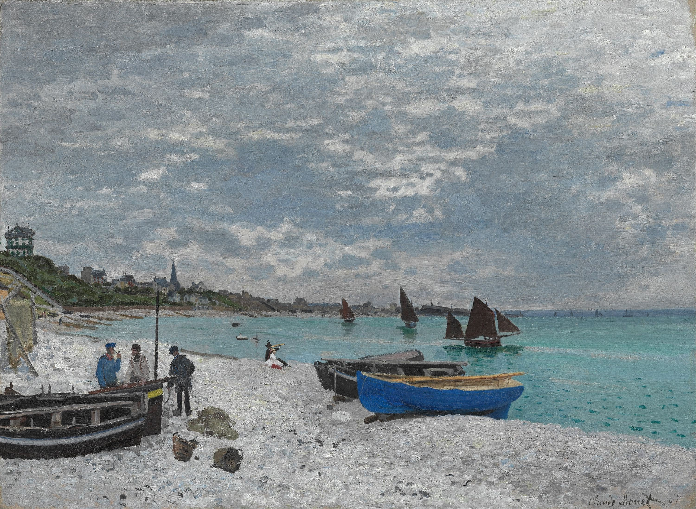

# hzen0883_9103_tut4_majorProject

# Huining Zeng's Personal Assignment

## Interaction Instructions

1. After sunset, clicking on the screen again will start the transition back to daytime.
2. Clicking on the screen in the initial state will start playing music.

## Personal Assignment Explanation

1. The entire scene transitions from sunset to night using a time-based method, creating a romantic and mysterious atmosphere by incorporating soothing music.
2.  The inspiration comes from another painting by Claude Monet: *The Beach at Sainte-Adresse*. This painting also depicts a tranquil harbor. Although it is not set at night, it shares a calm essence similar to our project. This inspired me to create a piece that allows viewers to settle down and enjoy the scene. 

3. Technical Description: First, set a timer to change the color of the wave effect over time. Then, allow the sun to slowly set according to the timer. Next, create a function `mousePressed` that, when the mouse is clicked, resets the timer value and starts playing background music if it is not already playing. Finally, clean up the timer, reset variable values, and enable the scene to resize with the window.
